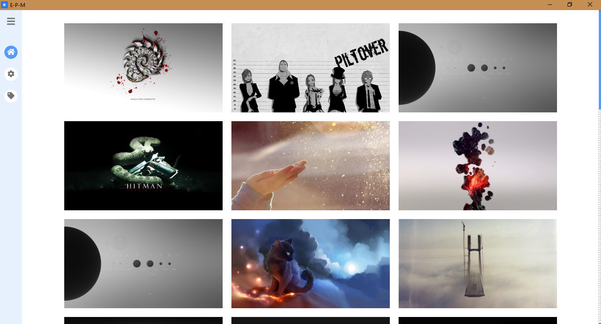
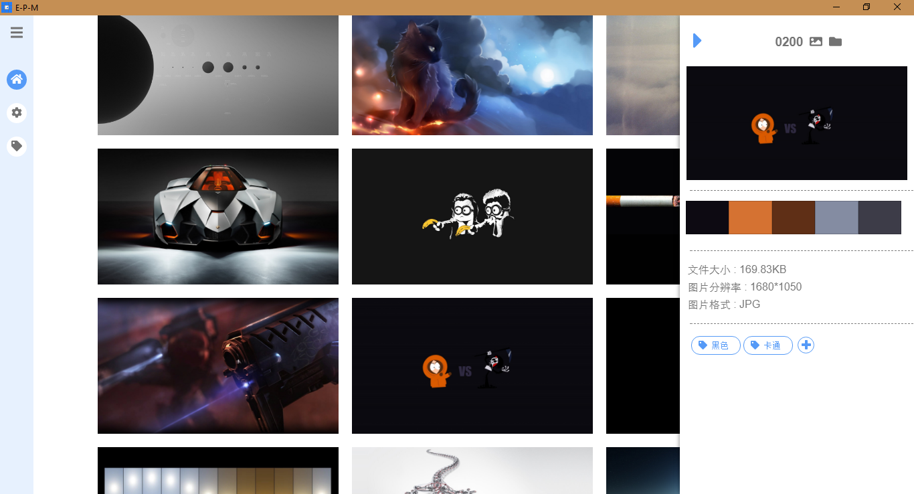

## 图片管理软件

---

使用 `electron` 框架制作的图片管理软件

## Download

[Download](https://github.com/cwxyz007/electron-PM/releases)

## Preview 

## TODO

[TODO](./TODO.MD)

## Development

---

### windows 

__Electron - Error: A dynamic link library (DLL) initialization routine failed.__

run `node_modules/.bin/electron-rebuild -f -w better-sqlite3`

> Install all the required tools and configurations using Microsoft's windows-build-tools using `npm install --global --production windows-build-tools` from an elevated PowerShell or CMD.exe (run as Administrator).

## 使用技术

- Electron
- React
- Scss
- Sqlite3
